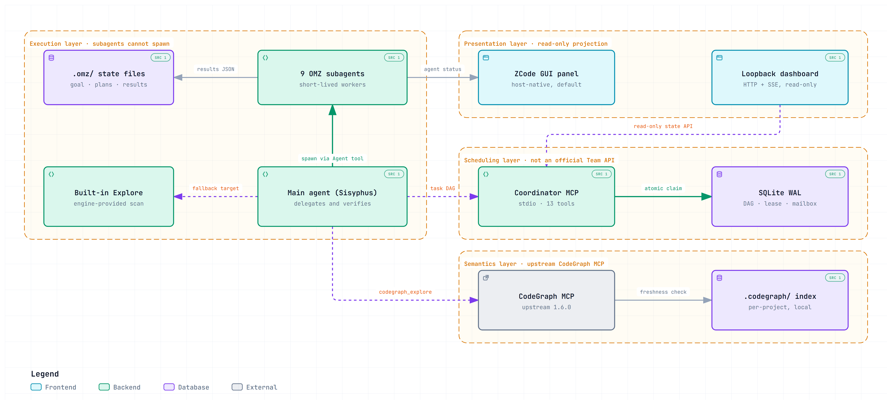

**English** | [简体中文](./README.zh-CN.md)

# OMZ (Oh My ZCode)

> **License boundary**: This repository is distributed under MIT (`LICENSE` contains only the full MIT text of this project itself). The upstream project [oh-my-openagent](https://github.com/code-yeongyu/oh-my-openagent) is under the **Sustainable Use License 1.0** (not an OSI license; it limits use to your own internal business purposes or to non-commercial/personal use). That license has been verified and is recorded, together with a verbatim overlap analysis, in `upstream/omo-sources.lock.json`: against the 15,824 8-grams of the four upstream `SKILL.md` files, only 9 8-grams are shared, and all 9 come from one and the same JSON enum line. How the boundary between the two licenses is to be judged is the project owner's decision; `upstream/` only records evidence.

A ZCode port of the orchestration capabilities of [oh-my-openagent (OmO)](https://github.com/code-yeongyu/oh-my-openagent) — capability parity, not code transplantation. The design rationale is in [DESIGN.md](./DESIGN.md) (the v1.5 installed-environment acceptance revision); implementation progress is in [CHANGELOG.md](./CHANGELOG.md) (currently 1.6.1).

## Purpose

Make projects on ZCode turn out better, weighting four classes of capability equally: parallel throughput (faster), specialized division of roles (deeper), independent review plus dual evidence (more reliable), and interview-driven planning (more accurate).

## Architecture at a glance

<picture>
  <source media="(prefers-color-scheme: dark)" srcset="./docs/omz-architecture.dark.png">
  
</picture>

<sub>The diagram is wide, so GitHub scales it down to the README column — open it full size ([light](./docs/omz-architecture.light.png) · [dark](./docs/omz-architecture.dark.png)) to read the labels.</sub>

Only the execution layer is always present — that is the `core` profile. The other three layers each sit behind their own switch that is **off by default**, and each has its own fallback, so a layer that is absent or broken degrades only itself: `graph` falls back to the built-in Explore plus Bash grep, `orchestration` to wave state files under `.omz/runtime/`, and `dashboard` to the ZCode GUI task panel plus `/omz-status`.

The same diagram is also a standalone interactive page, `docs/omz-architecture.html` — clone or download the repository and open it in a browser (GitHub does not render repository HTML inline). It carries four guided views (the default `core` path, DAG scheduling, semantic retrieval, and the three fallback chains), click-to-focus on any component, and source references back into this repository. The narrative version of the same structure is DESIGN §3.1 and §3.3; how the artifact is generated and verified is described in [docs/README.md](./docs/README.md).

## Installation (core profile, the default)

1. Place the whole `omz/` directory as a ZCode plugin (it contains `.zcode-plugin/plugin.json`). The manifest declares `agents` / `commands` / `skills` / `hooks` (`hooks/hooks.json`; a hook is enabled as soon as it is registered, while whether it actually injects is decided by the semantic gate `omz.keyword_hook`, which is **off by default**, see below) plus one `mcpServers.omz-coordinator` that is disabled by default; path variables uniformly use `${ZCODE_PLUGIN_ROOT}` and `${ZCODE_PROJECT_DIR}`.
2. **Restart the session / open a new session** — the agent manifest is a snapshot taken at session start (DESIGN §13 B19); without a restart the subagents are invisible.
3. `/omz-doctor` self-check: it should show that all 9 omz agents can be spawned, that frontmatter/model validation passes, and that `.omz/` is already in `.gitignore`. The offline equivalent is `npm run doctor` — note that it only performs static validation; the spawn ping must be run inside a session (DESIGN §10.1 V12, an item already closed out in the v1.5 installed-environment acceptance: inside a real session, 9/9 returned the passphrase).
4. Smoke test: `/ulw a small feature spanning 2 files`.

Requires **Node >= 22.13** (the coordinator and the dashboard use the built-in `node:sqlite`, zero native dependencies). This lower bound is not conservative rounding: on 22.5–22.12, `node:sqlite` sits behind the `--experimental-sqlite` flag, and importing it directly **crashes with a stack trace and exits** on `ERR_UNKNOWN_BUILTIN_MODULE` (empirically verified: the coordinator and the dashboard die immediately, only core is usable); it is available by default only from 22.13.0 on. The whole repository has zero third-party runtime dependencies.

`package.json` is marked `private: true`: OMZ is **distributed only as a ZCode plugin (git clone / placement in the plugin directory) and is not published to npm**. That field only blocks `npm publish`; it does not affect git-based distribution or plugin loading.

**Installing OMZ does not change ZCode's default chat behavior.** This is a product promise (DESIGN §15), not a "usually the case":

- Ordinary Q&A, code reading, and single-file quick edits are always handled directly by the main agent: no subagent spawn, no writes to `.omz/`, no team creation, no CodeGraph connection.
- Only explicitly typing `/ulw`, `/team`, or `/hyperplan` enters the corresponding mode.
- The keyword hook and the three profiles `graph`/`orchestration`/`dashboard` are **all off by default** and must be enabled explicitly.
- A failure in an optional layer only degrades that layer's capability; ordinary chat is unaffected. Uninstalling OMZ does not modify the user's pre-existing agents/skills/MCP configuration.
- The only fixed cost is the small number of tokens that the 9 agent descriptions add to the discovery context.

## Commands

| Command | What it does |
|---|---|
| `/ulw <goal>` | The eight-step ultrawork lifecycle: activation → goal registration → skill inventory → certainty safeguards → planning threshold → execution → dual-evidence verification → review gate and commit (+ 10 Hard rules) |
| `/team <goal>` | The seven-step Team Mode protocol: parallel orchestration of multiple workers (coordinator MCP, or the core wave-parallel fallback) |
| `/hyperplan` | Pure planning: omz-planner interview → omz-critic gap analysis → approval gate (no execution) |
| `/omz-status` | Status board (renders `.omz/` as wave × task × status, capped at 40 lines); the output of `tools/render-status.mjs` is authoritative |
| `/omz-doctor` | In-session self-check: spawn ping × 9, model validation, gitignore, mtime (B19), BOM scan (B4) |

## Subagents (9 + the built-in Explore)

Subagents **structurally have no Agent tool** (DESIGN §10.1 V5, empirically verified), so no role can spawn further; they also have no standalone `Grep`/`Glob`, and file search goes through Bash (B20).

| subagent_type | Responsibility | Tool surface |
|---|---|---|
| `omz-planner` | Interview-driven strategic planning (Prometheus) | `[Read, Bash, Write]` |
| `omz-critic` | Plan gap analysis (Metis) | `[Read, Bash]` |
| `omz-deep` | Deep autonomous coding (Hephaestus) | All tools, maxTurns guardrail |
| `omz-junior` | Single-task executor (Sisyphus-Junior) | All tools, further delegation forbidden (structurally) |
| `omz-atlas` | Wave state machine + dispatch-proposal generator + reporter (Atlas): does not spawn and does not implement itself; produces 8-element dispatch proposals and hands them back to the main agent | All tools |
| `omz-oracle` | Architecture consulting / hard debugging (Oracle) | `[Read, Bash]` |
| `omz-reviewer` | Adversarial review gate (Momus) | `[Read, Bash]` |
| `omz-librarian` | Docs/API retrieval (Librarian): no search-engine tool, fetches full text from known URLs | `[Read, Bash, WebFetch]` |
| `omz-looker` | Multimodal visual acceptance: Bash is used to enumerate image paths | `[Read, Bash]` |
| `explore` (built-in, reused) | Fast repository scan | Engine built-in |

For the read-only roles (critic/oracle/reviewer/librarian/looker), the whitelist does block `Edit`/`Write`, but it **does not block writing files through Bash** — each role's body lists the forbidden commands one by one and states that this particular constraint is held by self-discipline.

## Optional profiles (all off by default)

| Profile | Status | Enable | Fallback |
|---|---|---|---|
| `graph` | Requires external installation | Install `@colbymchenry/codegraph` (MIT) + `codegraph init` in the target project | Explore + Bash grep/rg |
| `orchestration` | ✅ Implemented (`mcp/coordinator/`) | `mcpServers.omz-coordinator.enabled` in `plugin.json` → `true` | core wave parallelism + `.omz/runtime/` file state |
| `dashboard` | ✅ Implemented (`dashboard/`) | Project `.zcode/config.json` → `{"omz":{"dashboard":{"enabled":true}}}` | ZCode GUI task panel + `/omz-status` |
| M2 keyword hook | ✅ Implemented (`hooks/`) | See below | slash commands (M1, zero risk) |

- **coordinator**: an stdio MCP sidecar with 13 tools; SQLite WAL is the single source of truth for tasks/dependencies/leases/mailbox. `now` is not in any tool's `inputSchema` (the scheduler clock is owned exclusively by the server side); claim goes through `BEGIN IMMEDIATE`, and `max_parallel` takes effect inside the same transaction; `complete`/`fail` have a terminal-state guard plus one-time consumption of dependency edges as two layers of duplicate protection. Details in [mcp/coordinator/README.md](./mcp/coordinator/README.md).
- **dashboard**: a read-only presentation layer where every endpoint is GET (any other method gets 405), with no write or command channel whatsoever. It binds loopback only, uses a random port, and mints a random token at every start; data endpoints require the token, while the static shell and `/healthz` are token-free (browser subresources do not carry the token). Details in [dashboard/README.md](./dashboard/README.md).
- **The switches of the keyword hook (only one of them needs any action from you)**: ① The **runtime layer** is the **element-level** `enabled` in the hooks array (`hooks.UserPromptSubmit[].hooks[].enabled`) — the engine reads only this one place (`=== false` discards that entry). OMZ **deliberately leaves it unset** (unset means enabled), so the runtime layer is open by default and you do **not** need to edit `hooks.json`. ② The **semantic layer (the real gate, at project granularity)**: `omz.keyword_hook` in the project's `.zcode/config.json`, or `keyword_hook` in `.omz/config.json` → `true`. While this is off, the script returns `{}` immediately and reads no files at all. So **enabling it only requires writing the project config and restarting the session**; only if you also want to save the roughly 120 ms of no-op cost on every message do you add `"enabled": false` to the hooks element. Note that `hooks.json` **has no top-level `enabled` field** (removed in v1.4): the engine's `parsePluginHookEvents` reads only the `hooks` field, and as soon as any plugin contributes a hook it **forces** `enabled: true` — whatever is written at the top level has no runtime effect, and keeping it would only make people believe that "flipping it to true enables the hook". Details in the three-layer switch table in [hooks/README.md](./hooks/README.md).

Each layer can be turned off individually; a failure only degrades the corresponding enhancement and does not affect core.

## Development and testing

```bash
npm test                  # All tests: 573 cases / 102 suites (equivalent to node --test tests/)
node --test tests/        # Same as above; a single file, e.g. node --test tests/protocol.test.mjs
npm run test:protocol     # Per-file scripts (9): path/fallback/transport/coordinator/mcp/dashboard/hooks/protocol/integration
                          # capability and cli have no dedicated script; run them one by one with node --test tests/<file>
npm run validate          # frontmatter conformance check (tools/validate-frontmatter.mjs .)
npm run doctor            # Offline environment self-check (exit 0 in the current repository state)
npm run doctor:supply-chain  # Supply-chain evidence; **expected to exit 1 in the default environment** — when the graph
                          # profile is not enabled, "the codegraph version cannot be obtained" is simply the fact
                          # (supply:codegraph is judged FAIL), and the unpinned upstream commit gives a separate WARN.
                          # It is a pre-release evidence tool, not a CI gate; do not wire it into a pipeline as a red/green light.
npm run status            # Render .omz/ status (the executable body behind /omz-status)
npm run hook:self-test    # Keyword hook self-check (30/30)
npm run sync:check        # Upstream lock fields and omz_target existence
npm run coordinator       # Start the coordinator by hand (stdio JSON-RPC)
npm run dashboard         # Pure HTTP dashboard; npm run dashboard:electron starts the Electron shell
```

## Repository discipline

Upstream OmO sync follows the selective sync process of DESIGN §16: no whole-repository fork, no direct `merge upstream/dev`; sources are pinned in `upstream/omo-sources.lock.json`, and the sync process together with the non-applicable paths is described in [upstream/README.md](./upstream/README.md). Attribution and third-party source declarations are in [NOTICE](./NOTICE) (`LICENSE` contains only the full MIT text of this project itself).
