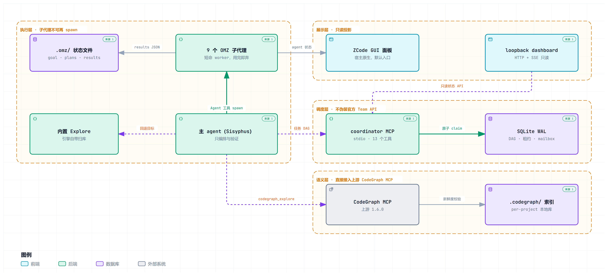

[English](./README.md) | **简体中文**

# OMZ (Oh My ZCode)

> **许可证边界**：本仓库以 MIT 分发（`LICENSE` 只含本项目自身的 MIT 全文）。上游 [oh-my-openagent](https://github.com/code-yeongyu/oh-my-openagent) 采用 **Sustainable Use License 1.0**（非 OSI 协议，限定为自有内部业务用途或非商业/个人用途）。该许可证已核实，并连同逐字重叠度分析一起记录在 `upstream/omo-sources.lock.json`：与上游四个 `SKILL.md` 的 15,824 个 8-gram 比对，共享 8-gram 仅 9 个，且全部来自同一处 JSON 枚举行。两个许可证之间的边界如何判断属项目所有者的决定，`upstream/` 只做取证记录。

对 [oh-my-openagent (OmO)](https://github.com/code-yeongyu/oh-my-openagent) 编排能力的 ZCode 移植——能力对标，不是代码搬运。设计依据见 [DESIGN.zh-CN.md](./DESIGN.zh-CN.md)（v1.5 装机验收修订版），实现进度见 [CHANGELOG.zh-CN.md](./CHANGELOG.zh-CN.md)（当前 1.6.1）。

## 定位

让 ZCode 上的项目做得更好：并行吞吐（更快）、角色专业分工（更深）、独立评审与双证据（更可靠）、访谈式规划（更准）四类能力并重。

## 架构一览

<picture>
  <source media="(prefers-color-scheme: dark)" srcset="./docs/omz-architecture.zh-CN.dark.png">
  
</picture>

<sub>图很宽，GitHub 会按 README 栏宽缩放——看清标签请打开原尺寸（[明色](./docs/omz-architecture.zh-CN.light.png) · [暗色](./docs/omz-architecture.zh-CN.dark.png)）。</sub>

只有执行层是必然存在的，那就是 `core` profile。另外三层各有自己的开关且**默认全部关闭**，也各有自己的回退，所以某一层缺失或坏掉只降级它自己：`graph` 回退到内置 Explore 加 Bash grep，`orchestration` 回退到 `.omz/runtime/` 下的波次状态文件，`dashboard` 回退到 ZCode GUI 任务面板加 `/omz-status`。

同一张图还有独立的交互页面 `docs/omz-architecture.zh-CN.html`——克隆或下载仓库后用浏览器打开（GitHub 不内联渲染仓库里的 HTML）。页面带四条导览视图（默认 `core` 路径、DAG 调度、语义检索、三条回退链）、点击任一组件聚焦、以及指回本仓库的源码引用。同一结构的文字版是 DESIGN §3.1 与 §3.3；产物如何生成与验证见 [docs/README.zh-CN.md](./docs/README.zh-CN.md)。

## 安装（core profile，默认）

1. 将整个 `omz/` 目录作为 ZCode 插件放置（含 `.zcode-plugin/plugin.json`）。清单声明 `agents` / `commands` / `skills` / `hooks`（`hooks/hooks.json`；hook 本身注册即启用，是否真的注入由语义闸 `omz.keyword_hook` 决定，**默认关闭**，见下）与一个默认关闭的 `mcpServers.omz-coordinator`；路径变量统一用 `${ZCODE_PLUGIN_ROOT}` 与 `${ZCODE_PROJECT_DIR}`。
2. **重启会话 / 新开会话**——agent 清单是会话启动时的快照（DESIGN §13 B19），不重启则子代理不可见。
3. `/omz-doctor` 自检：应显示 9 个 omz agent 全部可 spawn、frontmatter/model 校验通过、`.omz/` 已在 `.gitignore`。离线等价物是 `npm run doctor`——注意它只做静态校验，spawn ping 必须在会话内跑（DESIGN §10.1 V12，该项已在 v1.5 装机验收中结清：真实会话内 9/9 返回暗语）。
4. 冒烟：`/ulw 一个跨 2 文件的小特性`。

需要 **Node >= 22.13**（coordinator 与 dashboard 用内置 `node:sqlite`，零原生依赖）。这个下限不是保守取整：22.5–22.12 上 `node:sqlite` 在 `--experimental-sqlite` flag 之后，直接 import 会 `ERR_UNKNOWN_BUILTIN_MODULE` **崩栈退出**（实测：coordinator 与 dashboard 立即挂，只有 core 能用），22.13.0 起才默认可用。全仓库零第三方运行时依赖。

`package.json` 标了 `private: true`：OMZ **仅作 ZCode 插件分发（git clone / 插件目录放置），不发布到 npm**。该字段只阻止 `npm publish`，不影响 git 发布与插件装载。

**安装 OMZ 不改变 ZCode 默认聊天行为。** 这是产品承诺（DESIGN §15），不是"通常如此"：

- 普通问答、读代码、单文件 quick 小改一律由主 agent 直接处理，不 spawn 子代理、不写 `.omz/`、不建 team、不连 CodeGraph。
- 只有显式输入 `/ulw`、`/team`、`/hyperplan` 才进入对应模式。
- 关键词 hook 与 `graph`/`orchestration`/`dashboard` 三个 profile **默认全部关闭**，必须显式启用。
- 可选层失败只降级该层能力，普通聊天不受影响；卸载 OMZ 不修改用户原有 agents/skills/MCP 配置。
- 唯一固定成本是 9 条 agent description 进入发现上下文的少量 token。

## 命令

| 命令 | 作用 |
|---|---|
| `/ulw <目标>` | ultrawork 八步生命周期：激活 → 目标注册 → 技能盘点 → 确定性保障 → 规划门槛 → 执行 → 双证据验证 → 评审门与提交（+ 10 条 Hard rules） |
| `/team <目标>` | Team Mode 七步协议：多 worker 并行编排（coordinator MCP 或 core 波次并行回退） |
| `/hyperplan` | 纯规划：omz-planner 访谈 → omz-critic 差距分析 → 批准门（不执行） |
| `/omz-status` | 状态看板（渲染 `.omz/` 波次×任务×状态，40 行上限）；以 `tools/render-status.mjs` 输出为准 |
| `/omz-doctor` | 会话内自检：spawn ping × 9、model 校验、gitignore、mtime（B19）、BOM 扫描（B4） |

## 子代理（9 + 内置 Explore）

子代理**结构性没有 Agent 工具**（DESIGN §10.1 V5 实测），任何角色都不能再 spawn；也没有独立 `Grep`/`Glob`，文件搜索走 Bash（B20）。

| subagent_type | 职责 | 工具面 |
|---|---|---|
| `omz-planner` | 访谈式战略规划（Prometheus） | `[Read, Bash, Write]` |
| `omz-critic` | 计划差距分析（Metis） | `[Read, Bash]` |
| `omz-deep` | 深度自主编码（Hephaestus） | 全工具，maxTurns 护栏 |
| `omz-junior` | 单任务执行器（Sisyphus-Junior） | 全工具，禁止再委派（结构性） |
| `omz-atlas` | 波次状态机 + 派单建议生成器 + 汇报器（Atlas）：自己不 spawn 不实现，产出 8 要素派单建议回请主 agent | 全工具 |
| `omz-oracle` | 架构咨询/疑难调试（Oracle） | `[Read, Bash]` |
| `omz-reviewer` | 对抗性评审门（Momus） | `[Read, Bash]` |
| `omz-librarian` | 文档/API 检索（Librarian）：无搜索引擎工具，按已知 URL 抓全文 | `[Read, Bash, WebFetch]` |
| `omz-looker` | 多模态视觉验收：Bash 用于枚举图片路径 | `[Read, Bash]` |
| `explore`（内置复用） | 快速扫库 | 引擎内置 |

只读角色（critic/oracle/reviewer/librarian/looker）的白名单拦得住 `Edit`/`Write`，**拦不住 Bash 写文件**——各自正文逐条列出禁用命令并声明这一条靠自律守。

## 可选 profile（默认全部关闭）

| Profile | 状态 | 启用 | 回退 |
|---|---|---|---|
| `graph` | 需外部安装 | 安装 `@colbymchenry/codegraph`（MIT）+ 目标项目 `codegraph init` | Explore + Bash grep/rg |
| `orchestration` | ✅ 已实现（`mcp/coordinator/`） | `plugin.json` 的 `mcpServers.omz-coordinator.enabled` → `true` | core 波次并行 + `.omz/runtime/` 文件状态 |
| `dashboard` | ✅ 已实现（`dashboard/`） | 项目 `.zcode/config.json` → `{"omz":{"dashboard":{"enabled":true}}}` | ZCode GUI 任务面板 + `/omz-status` |
| M2 关键词 hook | ✅ 已实现（`hooks/`） | 见下 | slash commands（M1，零风险） |

- **coordinator**：stdio MCP sidecar，13 个工具，SQLite WAL 是任务/依赖/租约/mailbox 的唯一事实源。`now` 不在任何工具的 `inputSchema` 里（调度器时钟由服务端独占）；claim 走 `BEGIN IMMEDIATE`，`max_parallel` 在同事务内生效；`complete`/`fail` 有终态守卫 + 依赖边一次性消费双层防重。细节见 [mcp/coordinator/README.md](./mcp/coordinator/README.md)。
- **dashboard**：只读展示层，所有端点都是 GET（其它方法 405），无任何写入/命令通道。只绑 loopback、随机端口、每次启动随机 token；数据端点必须 token，静态壳与 `/healthz` 免 token（浏览器子资源不带 token）。细节见 [dashboard/README.md](./dashboard/README.md)。
- **关键词 hook 的开关（只有一道需要你动）**：① **运行层**是 hooks 数组的**元素级** `enabled`（`hooks.UserPromptSubmit[].hooks[].enabled`）——引擎只读这一处（`=== false` 即丢弃该条）。OMZ **有意留空**（留空即启用），所以运行层默认是通的，你**不需要**改 `hooks.json`。② **语义层（真闸，按项目粒度）**：项目 `.zcode/config.json` 的 `omz.keyword_hook` 或 `.omz/config.json` 的 `keyword_hook` → `true`。脚本在此关闭时立即返回 `{}`，不读任何文件。所以**启用只需写项目配置并重启会话**；要连每条消息约 120ms 的空跑成本一起省掉，才在 hooks 元素里加 `"enabled": false`。注意 `hooks.json` **顶层没有 `enabled` 字段**（v1.4 已删除）：引擎的 `parsePluginHookEvents` 只取 `hooks` 字段，且只要有插件贡献 hook 就**强制** `enabled: true`——顶层写什么都没有运行时效果，留着只会让人以为"改成 true 就启用了"。细节见 [hooks/README.md](./hooks/README.md) 的三层开关表。

每层可单独关闭，失败只降级对应增强，不影响 core。

## 开发与测试

```bash
npm test                  # 全部测试：573 用例 / 102 suites（等价 node --test tests/）
node --test tests/        # 同上；单文件如 node --test tests/protocol.test.mjs
npm run test:protocol     # 分文件脚本（9 个）：path/fallback/transport/coordinator/mcp/dashboard/hooks/protocol/integration
                          # capability 与 cli 无独立脚本，用 node --test tests/<file> 单跑
npm run validate          # frontmatter 规范校验（tools/validate-frontmatter.mjs .）
npm run doctor            # 离线环境自检（当前仓库状态下 exit 0）
npm run doctor:supply-chain  # 供应链取证；**在默认环境下预期 exit 1**——未启用 graph profile 时"取不到
                          # codegraph 版本"就是事实（supply:codegraph 判 FAIL），上游 commit 未 pin 另有 WARN。
                          # 它是发布前的取证工具，不是 CI 门，别接进流水线当红绿灯。
npm run status            # 渲染 .omz/ 状态（/omz-status 的执行体）
npm run hook:self-test    # 关键词 hook 自检（30/30）
npm run sync:check        # 上游 lock 字段与 omz_target 存在性
npm run coordinator       # 手工起 coordinator（stdio JSON-RPC）
npm run dashboard         # 纯 HTTP dashboard；npm run dashboard:electron 起 Electron 壳
```

## 仓库纪律

上游 OmO 同步走 DESIGN §16 的选择性同步流程：不整仓 fork、不直接 `merge upstream/dev`；来源锁定在 `upstream/omo-sources.lock.json`，同步流程与不适用路径见 [upstream/README.md](./upstream/README.md)。归属与第三方来源声明见 [NOTICE](./NOTICE)（`LICENSE` 只含本项目自身的 MIT 全文）。
